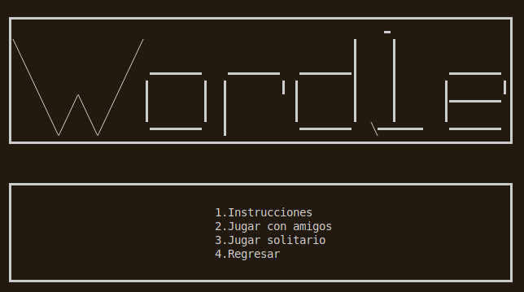
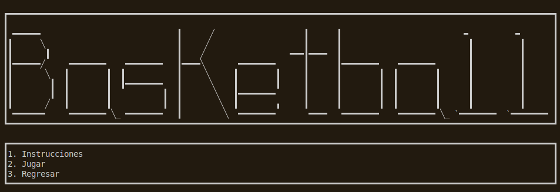
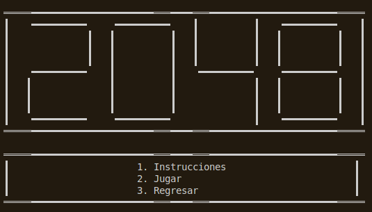

# Java-Games — User Manual (EN)

## Overview
Java-Games is a console collection of mini-games: Wordle, Basketball, and 2048. This manual explains how to run the app and play each game.

## Requirements
- Java (JDK 17+ recommended)
- Maven 3.8+

## How to Run
1. Open a terminal in the repository root.
2. Compile and run:
   - `mvn compile`
   - `mvn exec:java -Dexec.mainClass="main.Main"`

## Main Menu
- **1. Random game**: Launches a random game.
- **2. Choose game**: Opens the game selection menu.
- **3. Exit**: Closes the application.

## Wordle
- **Goal**: Guess the hidden word in 6 attempts.
- **Colors**:
  - Green = correct letter in correct position
  - Yellow = correct letter in wrong position
  - Red = letter not in the word
- **Modes**:
  - **Friends**: One player enters the secret word.
  - **Solo**: The game selects a word from the dictionary.

## Basketball
- **Goal**: Score more points after the selected number of rounds.
- Each round has two possessions (one per player).
- **Attack**: Choose 2‑point or 3‑point shot.
- **Defense**: Standard or aggressive (more blocks, more fouls).

## 2048
- **Goal**: Merge tiles to reach 2048.
- **Controls**: `W` (up), `A` (left), `S` (down), `D` (right).
- If no moves remain, the game ends.

## Screenshots
Add screenshots in `docs/images/` and reference them in the README or here. Example:

```



```

## Troubleshooting
- If input looks incorrect, press Enter and retry.
- If the game closes unexpectedly, rerun from the main menu.
